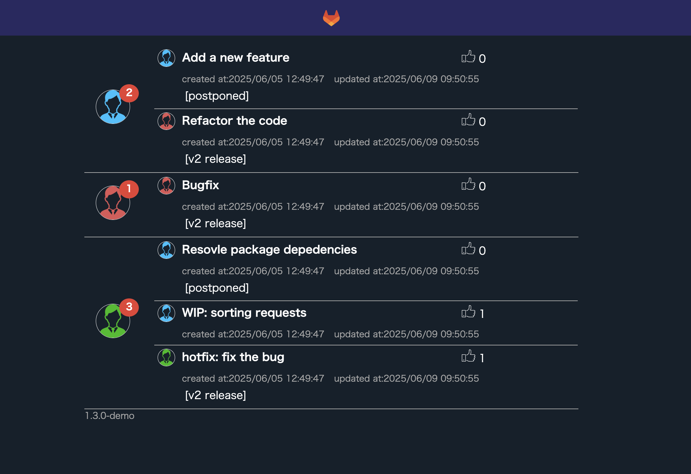

# About MRLS
This tool fetches and displays a list of GitLab Merge Requests. By grouping them by user, it clearly shows who is responsible for each MR.　<br>
Check out the demo page here: https://tttol.github.io/mrls/


# Quick Start

https://hub.docker.com/r/tttol/mrls

1. pull & run docker.io/tttol/mrls:latst
```bash
docker run --name mrls --env GITLAB_PROJECT_ID=xxxx --env GITLAB_ACCESS_TOKEN=xxxx --env GITLAB_HOST=xxx --env PROXY_HOST=xxx --env PROXY_PORT=xxx -it -p 8888:8080 tttol/mrls:latest
```
> [!NOTE]
> `PROXY_HOST` and `PROXY_PORT` are optional.

## Environment variables
- GITLAB_HOST
- GITLAB_PROJECT_ID
- GITLAB_ACCESS_TOKEN
    - project access token / personal access token / group access token
    - scope=`api`
    - More info -> https://docs.gitlab.com/ee/api/rest/
- PROXY_HOST (optional)
- PROXY_PORT (optioanl)

# Run container on your local(optional)

1. clone

```bash
git clone https://github.com/tttol/mrls.git
cd mrls
```

2. create docker image

```bash
./gradlew bootBuildImage
```

3. run container

```bash
docker run --name mrls --env GITLAB_PROJECT_ID=xxxx --env GITLAB_ACCESS_TOKEN=xxxx --env GITLAB_HOST=xxx --env PROXY_HOST=xxx --env PROXY_PORT=xxx -it -p 8888:8080 tttol/mrls:latest
```

# Release
Publish a tag in GitHub. The format of tag is `*.*.*`.<br>
The release script is here(https://github.com/tttol/mrls/blob/main/.github/workflows/deploy.yml).